## 报销细则

#### 清华(14+1人)
* 总则    
	以清华大学社会实践经费管理细则为基础。
	仅支持学生因开展实践所产生的必要的**城市间交通费**、**住宿费**、签证费、**保险费**和**物资采购费**等，以上费用在规定额度内凭据报销，禁止采用劳务代发等形式替代报销。
	特殊情况向主管单位反映。（以下主管单位指车辆学院）
	
	> 可见，伙食费无法报销
	> 支队在实践地城市内的交通工具费用也不能报销（实践地在北京例外）
	
* 交通费  
	1.城市间交通费指支队成员在实践出行阶段乘坐火车、轮船、飞机、汽车等交通工具跨越城市间所产生的费用，包括实践前地点到实践地、实践地到实践后地点以及多个实践地之间的交通费。报销时**支队应提供以北京为起点和终点的完整闭环交通票据作为证明材料**。**城市间交通费（由主管单位）取“实践前地点→实践地→实践后地点”与“北京→实践地→北京”两者中费用较低者报销。**  
	
	> 我们尽可能把所有路程的所有车票都准备好  
	
	2.支队成员乘坐有硬席（硬座或硬卧）座位**火车**的，按**对应硬席票价**报销；乘坐**动车或高铁**的，按**二等座票价**报销；乘坐**轮船**的，按**三等舱票价**报销；境内实践支队成员乘坐**飞机**的，取**对应行程火车硬席、动车或高铁二等座的票价**报销，且不应高于实际经济舱票价。其他公共交通工具根据实际情况，由主管单位审核确认报销标准。在交通不方便的地区，如必须自驾车或租车，应提供相关说明，由主管单位审核确认报销标准，凭据报销。  
	
	> 凭据报销，照片无效。报销火车退票费需要去火车站窗口取退票凭证。 
	> **火车软卧**的报销费用是对应**硬座** 
	> 关于乘坐**飞机**的报销费用，主管单位会根据相同路线的**高铁二等座**票价报销  
	
* 住宿费 
	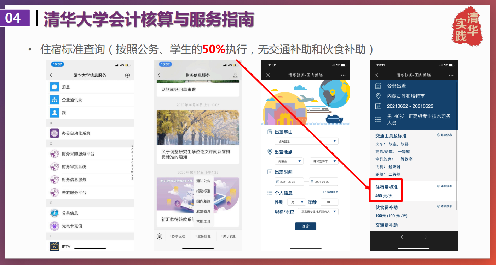 
	
	> 出差事由填 “公务”
	> 出差地点最好选到市
	> 职称/职务选“其余”
	> 学生社会实践无交通费补助和伙食费补助

	1.经查询，咱们的住宿费报销额度为**175元/人/天**，结合外联部提供的住宿费参考，刚好支持我们入住标间。  
	2.住宿费除发票还需开据**流水单 **   
	
* 保险费  
	实践出行前由校团委为所有支队成员统一购买符合要求的保险。  
	
* 物资采购费
	1.支队因开展实践所购买或制作的必要的**药品、队旗、队服、海报、支队手册、图书**等物资的费用凭据报销。
	
  > 核酸检测费用予以额度内的报销，需提供发票和检测单据。   
	
	2.因与实践地单位联络等礼节性需要购买的适量**纪念品**可以凭据报销，但应遵循从简节约的原则。原则上纪念品**单价不得超过200元**，每支支队购买的纪念品**总价不得超过500元**。  
	
* 额度
	“新时代实践梦想计划”支持标准
	
	|支持类别|支持对象|支持目标|匹配额度|
	|---|---|---|---|
	|实践品牌项目经费|院系/学生组织/个人|至少持续1学年；每学年各单位不超过2个；鼓励专业课程、科研项目、学科赛事和学生社团特色活动等相结合；支持通过创新创业赛事深入转化|寒暑假分期评级，第一阶段预计为三个等级支队分别匹配不超过25000元、15000元、10000元的经费支持额度|
	|院系实践基础经费|院系|鼓励院系团委制定特色鲜明的实践工作计划；支持院系开展重点突出的社会实践方向引领工作|**院系基础经费支持额度将根据院系参与情况和管理情况确定**|
	|院系支队实践经费|重点（2022年秋季学期实践总结环节院系推荐产生）|根据实践表现和总结成果推荐一定比例支队|如获评A、B、C等级，可分别获得8000元、6000元、4000元的经费支持额度|
	|同上|其他|学生自主开展|如获评A、B、C等级，可分别获得4000元、3000元、2000元的经费支持额度|

	> 我们支队的报销额度将受**院系实践基础经费**和**院系支队实践经费**两项支持，除此之外还有赞助~~（如果有的话）~~
	> 车辆学院**实践基础经费是4000**

#### 同济(6人)和上交(1人)  

  > 未立项，无法报销。  
  > 不过目前张唯琛同学正在拉赞助。

## 报销规范

* 开票信息（逐字核对）
	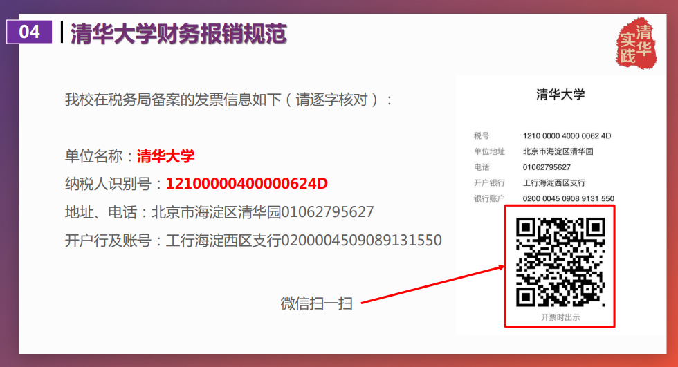  

* 盖章规范
	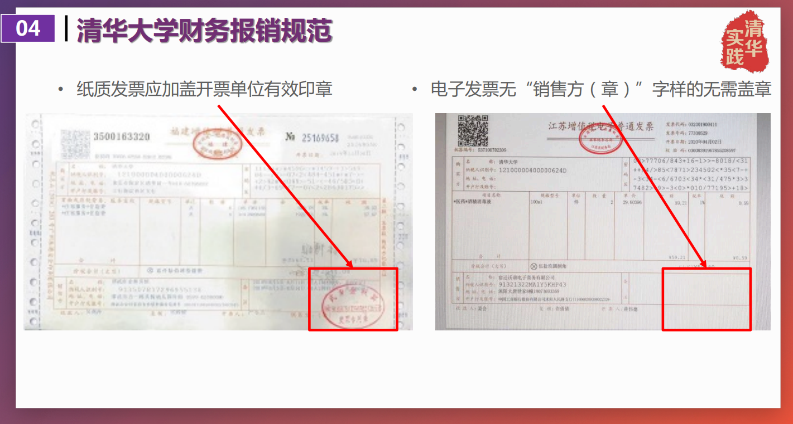  

* 票据粘贴
	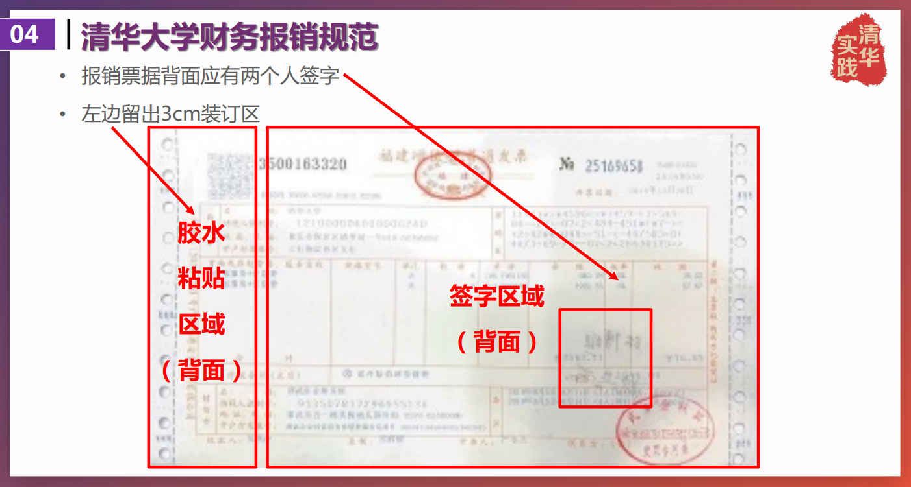  
	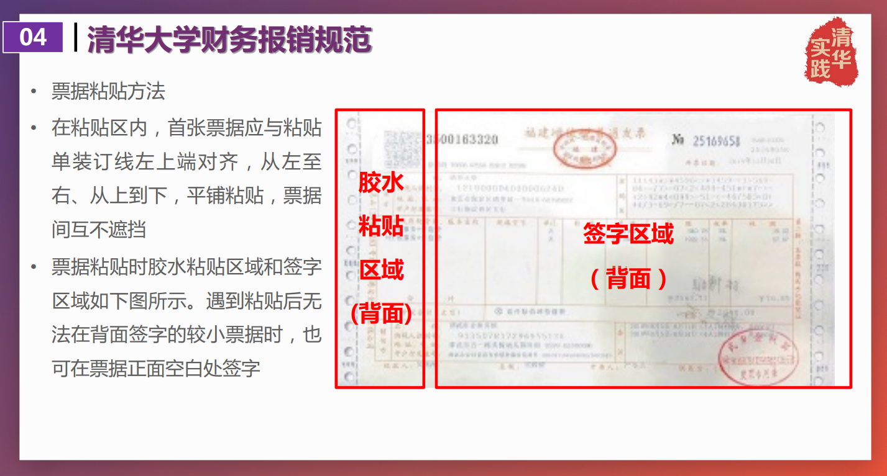  
	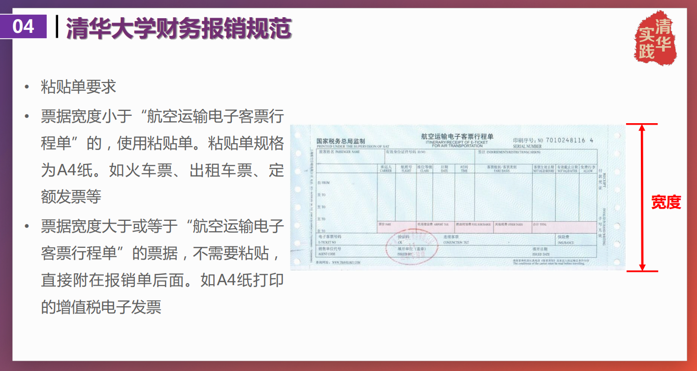  
	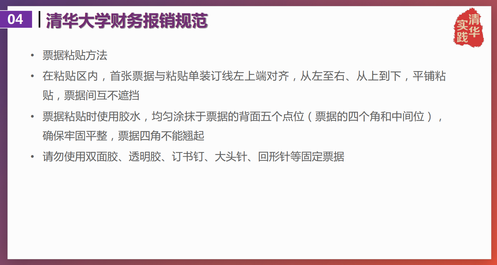  
	  
* 注意事项
	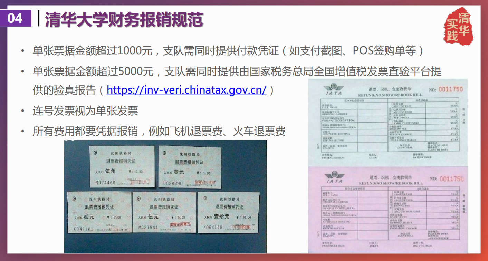  
	* 火车票即是报销凭证  
	  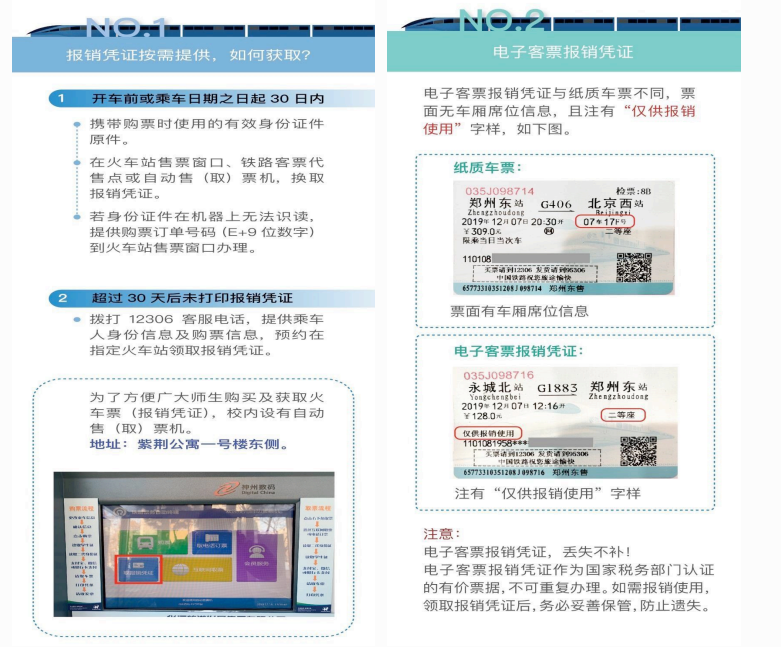  
	  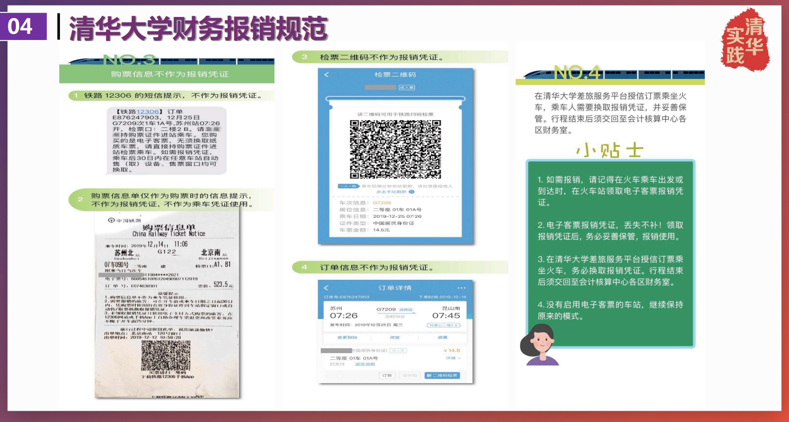
	
	  > 图片太多不看版：
	  > 1.获取报销凭证：
	  > 	* 乘车日期起 30 天内，携带身份证在火车站售票窗口换取火车票（报销凭证）
	  > 	* 乘车日期起 30 天后，拨打12306，预约在指定火车站领取报销凭证
	  > 	* **然而**：（12306官网关于报销凭证的说明）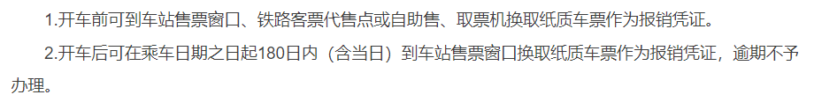  
	  > 	2.铁路12306的短信提示、购票信息单、检票二维码、订票信息不作为报销凭证
	  
	* 飞机票亦是报销凭证
	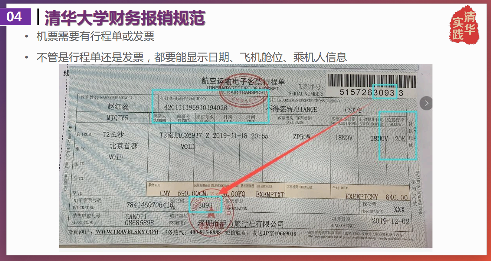  

## 开支明细

1.交通工具

2.住宿

3.预备药品(待补充)

| 药品 | 数量 | 价格 |
| ---- | ---- | ---- |
| |||
| |||

* 目前的计划
1、进藏前千万不要感冒发烧，否则在藏期间由于气候原因，恢复过程会很漫长，严重降低效率。
2、进藏前一周不要进行高强度有氧运动，尽量让身体保持一个较为轻松的状态，不要熬夜，保持充足的睡眠，这样对之后抗高原反应很有效。
3、如果实在担心，可以在10d前买适量红景天泡茶喝（注意是红景天根部效果更好，但说实话，可能只起到心理作用而已）
4、在抵达当天需要适应高原环境，保持积极良好的心态，活动量不要太大。
5、如果说临时突发高原反应或者感冒等病症，也不要紧张，直接去医院救治即可，一般来说问题都不会太大。
6、药物方面：感冒药、晕车药、止痛片、葡萄糖、肠胃药都要带一些，如果考虑专业性药物，可以买一些利尿剂乙酰唑胺。
7、衣物方面：7月为西藏雨季，而且昼夜温差大，建议携带长裤和稍微厚一点的上衣（比如羽绒服），紫外线强烈，还要有防嗮装备（墨镜等）。防寒防雨用具也要齐全
