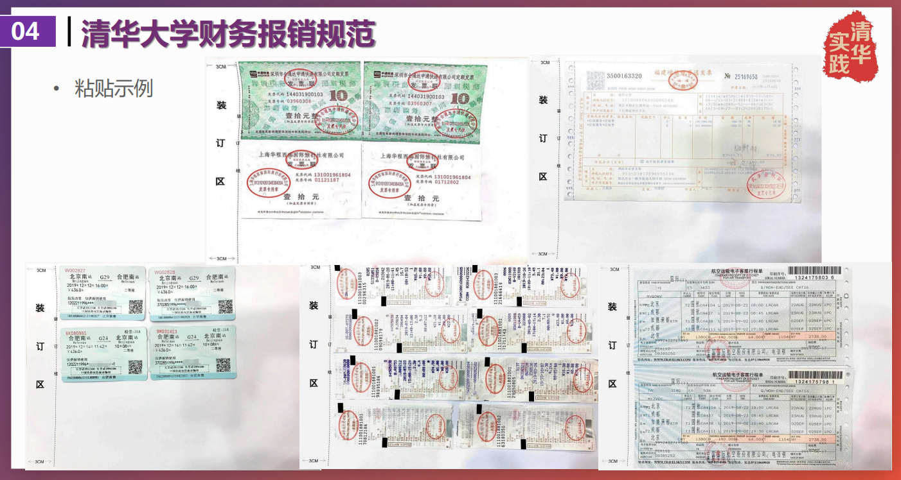

## 报销细则

#### 清华
* 总则    
	以清华大学社会实践经费管理细则为基础。
	仅支持学生因开展实践所产生的必要的城市间**交通费**、**住宿费**、签证费、**保险费**和**物资采购费**等，以上费用在规定额度内凭据报销，禁止采用劳务代发等形式替代报销。
	特殊情况向主管单位反映。

* 交通费  
	1.城市间交通费指支队成员在实践出行阶段乘坐火车、轮船、飞机、汽车等交通工具跨越城市间所产生的费用，包括实践前地点到实践地、实践地到实践后地点以及多个实践地之间的交通费。报销时支队应提供以北京为起点和终点的**完整闭环交通票据作为证明材料**。**城市间交通费取“实践前地点→实践地→实践后地点”与“北京→实践地→北京”两者中费用较低者报销。**  
	
	2.支队成员乘坐有硬席（硬座或硬卧）座位**火车**的，按**对应硬席票价**报销；乘坐**动车或高铁**的，按**二等座票价**报销；乘坐**轮船**的，按**三等舱票价**报销；境内实践支队成员乘坐**飞机**的，取**对应行程火车硬席、动车或高铁二等座的票价**报销，且不应高于实际经济舱票价。其他公共交通工具根据实际情况，由主管单位审核确认报销标准。在交通不方便的地区，如必须自驾车或租车，应提供相关说明，由主管单位审核确认报销标准，凭据报销。  
	
	> 凭据报销，照片无效。报销火车退票费需要去火车站窗口取退票凭证。
	
* 住宿费  
	 
	
	> 出差事由填 “**公务**”
	> 出差地点最好选到市
	> 职称/职务选“**其余**”
	> 学生社会实践**无交通费补助和伙食费补助**
	> 住宿费除发票还需开据**流水单**
	
* 保险费  
	实践出行前由校团委为所有支队成员统一购买符合要求的保险。  
	
* 物资采购费
	1.支队因开展实践所购买或制作的必要的**药品、队旗、队服、海报、支队手册、图书**等物资的费用凭据报销。
	
  > 核酸检测费用予以额度内的报销，需提供发票和检测单据。   
	
	2.因与实践地单位联络等礼节性需要购买的适量**纪念品**可以凭据报销，但应遵循从简节约的原则。原则上纪念品**单价不得超过200元**，每支支队购买的纪念品**总价不得超过500元**。  
	
* 额度
	“新时代实践梦想计划”支持标准
	
	|支持类别|支持对象|支持目标|匹配额度|
	|---|---|---|---|
	|实践品牌项目经费|院系/学生组织/个人|至少持续1学年；每学年各单位不超过2个；鼓励专业课程、科研项目、学科赛事和学生社团特色活动等相结合；支持通过创新创业赛事深入转化|寒暑假分期评级，第一阶段预计为三个等级支队分别匹配不超过25000元、15000元、10000元的经费支持额度|
	|院系实践基础经费|院系|鼓励院系团委制定特色鲜明的实践工作计划；支持院系开展重点突出的社会实践方向引领工作|**院系基础经费支持额度将根据院系参与情况和管理情况确定**|
	|院系支队实践经费|重点（2022年秋季学期实践总结环节院系推荐产生）|根据实践表现和总结成果推荐一定比例支队|如获评A、B、C等级，可分别获得8000元、6000元、4000元的经费支持额度|
	|同上|其他|学生自主开展|如获评A、B、C等级，可分别获得4000元、3000元、2000元的经费支持额度|

	> 我们支队的报销额度将受**院系实践基础经费**和**院系支队实践经费**两项支持，除此之外还有赞助~~（如果有的话）~~
	> 院系实践基础经费具体额度需咨询院系财务报销老师

#### 同济  

> 未立项，无法报销。
> 不过目前张唯琛同学正在拉赞助。

## 报销规范

* 开票信息（逐字核对）
	  

* 盖章规范
	  

* 票据粘贴
	  
	
	
	
	
* 注意事项
	  
	* 火车票即是报销凭证
	  
	* 飞机票亦是报销凭证
	  
	
## 开支明细

1.交通工具

2.住宿

3.预备药品(完全照搬，待修改)

| 药品 | 数量 | 价格 |
| ---- | ---- | ---- |
|六神 花露水 |8||
滴露 卫生湿巾 10 片| 8||
医用碘伏消毒喷雾| 1||
复方氨酚烷胺片（治感冒） |3||
维 C 银翘片| 2||
胃康灵胶囊 48 粒| 1||
铝碳酸镁咀嚼片 20 片 |1||
同仁堂 感冒退烧片 60 片| 1||
吗丁啉 多潘立酮片 42 片| 1||
江中 健胃消食片 64 片 |2||
云安白药 创可贴 100 片装 |1||
免洗洗手液 100ml |39||
999 感冒灵颗粒 9 袋 |1||
同仁堂 感冒清热颗粒 12 袋 |5||
医用口罩 100 片 |1||
善存 褪黑素维生素 B6 软胶囊 90 粒 |3||
蓝芩口服液 12 支 |3||
藿香正气软胶囊 16 粒| 4||

